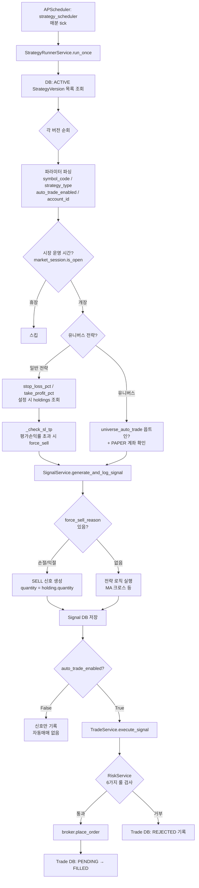
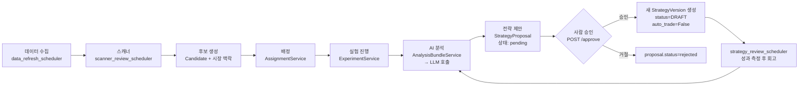

# PROGRAM-FLOW.md — 전체 매매·연구 흐름

> 마지막 갱신: 2026-06-23  
> 대상 독자: 이 레포를 처음 읽는 사람, 또는 특정 흐름을 재확인하고 싶은 운영자

---

## 1. 시스템 전체 조감도

```
 ┌─────────────────────────────────────────────────────────────────────────┐
 │                        AI Trading Platform                              │
 │                                                                         │
 │  ┌─────────────┐     ┌──────────────────────────────────────────────┐  │
 │  │  Frontend   │────▶│              FastAPI Backend                 │  │
 │  │ (React 18)  │◀────│                                              │  │
 │  └─────────────┘     │  ┌────────────┐   ┌───────────────────────┐ │  │
 │                       │  │ APScheduler│   │   REST API Routes     │ │  │
 │  ┌─────────────┐     │  │  (jobs)    │   │  /api/v1/*            │ │  │
 │  │ PostgreSQL  │◀───▶│  └────────────┘   └───────────────────────┘ │  │
 │  │  (trading_  │     │                                              │  │
 │  │  platform)  │     │  ┌────────────┐   ┌───────────────────────┐ │  │
 │  └─────────────┘     │  │  Services  │   │  Trading Layer        │ │  │
 │                       │  │  (domain   │   │  broker/kis_paper.py  │ │  │
 │  ┌─────────────┐     │  │   logic)   │   │  broker/kis_real.py   │ │  │
 │  │ KIS OpenAPI │◀───▶│  └────────────┘   └───────────────────────┘ │  │
 │  │ (국내/해외) │     └──────────────────────────────────────────────┘  │
 │  └─────────────┘                                                        │
 │                                                                         │
 │  ┌─────────────┐  ┌─────────────┐  ┌─────────────┐                    │
 │  │  DART API   │  │ EDGAR API   │  │ Gemini/      │                    │
 │  │ (국내 공시) │  │ (미국 공시) │  │ OpenAI LLM  │                    │
 │  └─────────────┘  └─────────────┘  └─────────────┘                    │
 └─────────────────────────────────────────────────────────────────────────┘
```

---

## 2. 자동매매 실행 흐름

### 2-1. 매분 실행되는 전략 러너 (strategy_scheduler)



### 2-2. 6가지 리스크 룰 (RiskService)

| 룰 | 조건 | 설명 |
|----|------|------|
| EmergencyStop | `RiskConfig.emergency_stop = True` | 즉시 전체 거래 중단 |
| MaxDailyLoss | 당일 실현손실 ≥ `max_daily_loss_amount` | 일일 손실 한도 초과 |
| MaxPositionSize | 주문 금액 > `max_position_size` | 단일 포지션 크기 초과 |
| MaxOpenPositions | 현재 보유 종목 수 ≥ `max_open_positions` | 최대 보유 종목 초과 |
| MaxTradesPerDay | 당일 체결 건수 ≥ `max_trades_per_day` | 일일 거래 횟수 초과 |
| ConsecutiveLoss | 연속 손실 횟수 ≥ `consecutive_loss_limit` | 연속 손실 한도 초과 |

### 2-3. 실거래 안전장치 (다중 계층)

```
계층 1: config.kis_real_trading_enabled = False (기본값)
         → 서버 기동 시 실계좌 브로커 자체를 비활성화

계층 2: KisRealBroker.place_order()
         → real_trading_enabled=False 이면 RealTradingDisabledError 즉시 발생

계층 3: StrategyVersion.parameters.auto_trade_enabled = False (기본값)
         → AI 제안 승인 시 강제로 False로 설정 (사람이 명시적으로 켜야)

계층 4: 유니버스 자동매매 추가 가드
         → universe_auto_trade=True(옵트인) + PAPER 계좌만 허용
         → max_orders_per_run 캡으로 회당 주문 수 제한
```

---

## 3. 연구 루프 흐름

### 3-1. 전체 파이프라인



### 3-2. 각 스케줄러 잡 요약

| 잡 이름 | 기본 활성 | 주기 | 역할 |
|---------|----------|------|------|
| `strategy_scheduler` | **True** | 1분 | 전략 신호 생성 + 자동매매 실행 |
| `order_sync_scheduler` | **True** | 5분 | 체결 내역 동기화 |
| `trading_state_sync_scheduler` | False | 30분 | TradingGuard 상태 동기화 |
| `daily_report_scheduler` | False | 매일 08:00 KST | 일일 리포트 생성 |
| `data_refresh_scheduler` | False | 1시간 | 시세·지표 갱신 |
| `research_pipeline_scheduler` | False | 30분 | 후보 탐색 + 배정 |
| `scanner_review_scheduler` | False | 1시간 | 스캐너 성과 검토 |
| `strategy_review_scheduler` | False | 1시간 | 전략 성과 검토 + 회고 |
| `us_market_refresh_scheduler` | False | 30분 | 미장 데이터 갱신 |
| `operations_digest_scheduler` | False | 매일 09:00 KST | 운영 다이제스트 생성 |
| `dart_ingest_scheduler` | False | 30분 | DART 공시 수집 |
| `edgar_ingest_scheduler` | False | 1시간 | SEC EDGAR 공시 수집 |
| `intraday_event_monitor_scheduler` | False | 5분 | 장중 이벤트 감지 |

> **기본 비활성 정책**: 연구 루프 잡은 모두 기본 False. 새 잡 추가 시도 동일.

---

## 4. AI 분석 파이프라인

```
사용자/스케줄러
     │ POST /api/v1/analysis/run (또는 스케줄러 트리거)
     ▼
AnalysisBundleService.build_for_version(strategy_version)
     │
     ├─ MarketContextService  → 거시 지표 (KOSPI/시가총액/환율 등)
     ├─ MacroRegimeService    → 매크로 체제 (확장/수축/불확실)
     ├─ TradeTapeService      → 최근 거래 내역 (시장 필터)
     ├─ CandidateService      → 종목 후보 컨텍스트
     ├─ NewsCuratorService    → 뉴스/공시 (symbol 있으면 종목 뉴스,
     │                           없으면 시장 레벨 뉴스)
     └─ ExperimentService     → 실험 성과 히스토리
     
     │ bundle JSON 조립 완료
     ▼
LLM 호출 (Gemini Flash / OpenAI GPT-4o 등)
     │
     ▼
StrategyProposal 생성
     status = "pending"
     proposed_params = {...}
     
     │ 사람이 POST /approve
     ▼
StrategyVersion 신규 생성
     status = DRAFT
     auto_trade_enabled = False  ← 강제
     parameters = proposed_params
```

---

## 5. 데이터 모델 핵심 관계

```
Account ─────────────────────────────────────────────────────┐
    │                                                         │
    └─▶ RiskConfig (1:1)                                      │
                                                              │
Strategy ──▶ StrategyVersion (1:N)                           │
                    │                                         │
                    ├─▶ Signal (1:N)                          │
                    │      └─▶ Trade (1:1)                    │
                    │              └─▶ Account ◀──────────────┘
                    │
                    ├─▶ StrategyProposal (1:N)
                    │      └─▶ StrategyVersion (승인 시 새 버전)
                    │
                    └─▶ StrategyExperiment (1:N)

Candidate ──▶ CandidateAssignment ──▶ StrategyVersion
                    └─▶ CandidateOutcome

Disclosure (DART/EDGAR) ──▶ DisclosureAssessment
                             └─▶ IntraWeekDisclosureTrigger
```

**주요 enum 상태 전이**:
- `StrategyVersionStatus`: DRAFT → ACTIVE → PAUSED / ARCHIVED
- `SignalType`: BUY / SELL / HOLD
- `OrderStatus`: PENDING → FILLED / REJECTED / CANCELLED
- `StrategyProposalStatus`: pending → approved / rejected

---

## 6. 용어 사전

| 용어 | 설명 |
|------|------|
| **StrategyVersion** | 전략의 특정 파라미터 스냅샷. 개선은 항상 새 버전으로 생성 |
| **Signal** | 매수/매도/보유 판단. 자동매매 여부와 관계없이 항상 기록 |
| **Trade** | 실제(또는 모의) 브로커에 제출된 주문. 체결/거부/취소 상태 추적 |
| **StrategyProposal** | AI가 생성한 파라미터 개선안. 항상 `pending` 상태로 저장 |
| **Candidate** | 스캐너가 발굴한 종목 후보. 전략 배정의 대상 |
| **CandidateAssignment** | 후보 종목에 전략이 배정된 기록 |
| **RiskConfig** | 계좌별 리스크 한도 설정 (6가지 룰의 임계값) |
| **MarketCode** | KR (국내) / US (미국) — 브로커 라우팅 기준 |
| **stop_loss_pct** | 브로커 평가손익률이 이 값 이하(-%)면 강제 전량 매도 |
| **take_profit_pct** | 브로커 평가손익률이 이 값 이상(+%)면 강제 전량 매도 |
| **universe_auto_trade** | 유니버스 전략의 자동매매 옵트인 플래그 (모의계좌 전용) |
| **force_exit** | 장 마감 시 미결 포지션 강제 청산 (exit_on_close=True 시) |
| **TradingGuardState** | paused/active — 전역 거래 일시정지 스위치 |
| **PAPER** | 모의계좌 유형. 유니버스 자동매매는 이 유형만 허용 |
| **ACTIVE** | StrategyVersion이 실시간 신호를 생성하는 활성 상태 |
| **bundle** | AI 분석에 주입되는 컨텍스트 패키지 (거시/뉴스/거래내역/성과) |
