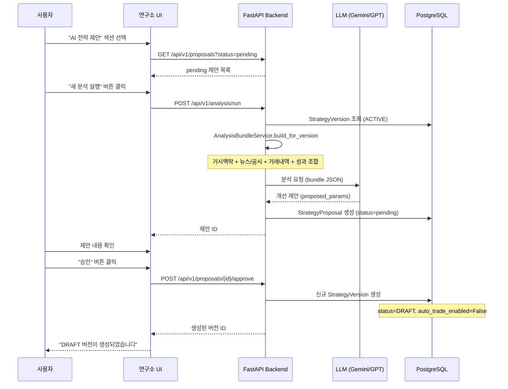

# RESEARCH-LAB-GUIDE.md — 프론트 "연구소" UI 단계별 가이드

> 마지막 갱신: 2026-06-23  
> 대상: 연구소(ResearchPage) 탭을 처음 사용하는 사람

---

## 1. 연구소 탭 지도

연구소(`/` → "연구소" 탭)에는 **24개 섹션**이 나열된 상단 네비게이션이 있다.  
섹션은 기능에 따라 아래 6개 그룹으로 분류할 수 있다.

### 그룹 A — 운영 모니터링
| 섹션 | 설명 |
|------|------|
| **운영 종합** | 잡 상태, 검토 대기 건수, 회고 요약 종합 뷰 |
| **운영 추세** | 일별 신호/거래/제안 추이 차트 |
| **자율 잡 제어** | 각 스케줄러 잡을 개별 ON/OFF할 수 있는 토글 |
| **안전 점검** | 안전 불변식 현황 (실거래 비활성 여부, emergency_stop 등) |
| **AI 비용** | LLM 호출 비용 누적 추이 |

### 그룹 B — 연구 파이프라인
| 섹션 | 설명 |
|------|------|
| **파이프라인** | research_pipeline 잡 실행 현황 |
| **스캐너** | 등록된 스캐너 목록 및 마지막 스캔 결과 |
| **후보 종목** | 스캐너가 발굴한 종목 후보 목록 |
| **전략 배정** | 후보 종목에 배정된 전략 현황 |
| **실험 비교** | 동일 종목에 배정된 여러 버전 비교 |

### 그룹 C — AI 제안 검토
| 섹션 | 설명 |
|------|------|
| **AI 전략 제안** | LLM이 생성한 전략 파라미터 개선 제안 목록 |
| **AI 스캐너 제안** | LLM이 생성한 스캐너 개선 제안 목록 |
| **제안 회고** | 승인된 제안이 실제로 성과를 개선했는지 추적 |
| **제안 퍼널** | 제안 생성 → 검토 → 승인/거절 깔때기 지표 |
| **분석 감사** | LLM 분석 실행 이력 및 비용 상세 |

### 그룹 D — 실전 승격 관리
| 섹션 | 설명 |
|------|------|
| **실전 승격** | DRAFT → ACTIVE 승격 이력 |
| **승격 준비** | 승격 대기 중인 버전의 준비 상태 체크리스트 |
| **일일 리포트** | 자동 생성된 일일 매매 리포트 |

### 그룹 E — 시장 데이터
| 섹션 | 설명 |
|------|------|
| **시장 맥락** | 거시 지표 스냅샷 (KOSPI, 환율, 외국인/기관 수급) |
| **매매 차트** | 종목별 캔들 + 신호 오버레이 차트 |
| **데이터 신선도** | 각 데이터 소스의 마지막 갱신 시각 |

### 그룹 F — 리스크 & 포트폴리오
| 섹션 | 설명 |
|------|------|
| **포트폴리오** | 현재 보유 포지션 + 평가손익 |
| **거래 활동** | 최근 거래 이력 및 통계 |
| **리스크 이벤트** | RiskService가 거부한 주문 로그 |

---

## 2. 핵심 워크플로우: AI 제안 생성 → 승인



> **중요**: 승인 버튼을 눌러도 자동매매가 켜지지 않는다.  
> 생성된 버전은 항상 `DRAFT` 상태이며, `auto_trade_enabled=False`가 강제된다.  
> 실제 운용하려면 전략 편집 페이지에서 사람이 직접 ACTIVE로 승격해야 한다.

---

## 3. 단계별 가이드: 처음 시작하는 사람을 위한 순서

### Step 1 — 안전 점검 확인 (safety)
- "안전 점검" 섹션에서 다음이 모두 초록색인지 확인:
  - `KIS_REAL_TRADING_ENABLED = false`
  - `emergency_stop = false` (비상정지 해제 상태)
  - 자율 잡이 의도대로 ON/OFF 상태인지

### Step 2 — 데이터 신선도 확인 (freshness)
- "데이터 신선도" 섹션에서 주요 데이터 소스의 마지막 갱신 시각 확인
- `data_refresh_scheduler`가 꺼져 있으면 수동으로 데이터를 갱신해야 함

### Step 3 — 파이프라인 현황 파악 (pipeline → candidates)
- "파이프라인" 섹션: 마지막 research_pipeline 실행 결과
- "후보 종목" 섹션: 발굴된 후보 목록 (최신순)
- "전략 배정" 섹션: 어느 후보에 어느 전략이 배정되어 있는지

### Step 4 — 실험 비교 (experiments)
- 동일 종목에 배정된 여러 전략 버전의 성과를 나란히 비교
- 어느 버전이 더 나은지 확인 후 AI 분석 대상 선정

### Step 5 — AI 제안 검토 (proposals)
- pending 상태의 제안 확인
- `proposed_params`와 `reasoning` 내용을 읽고 납득되면 승인
- 납득 안 되면 거절(또는 무시)

### Step 6 — 승격 관리 (promotions)
- 승인된 제안으로 생성된 DRAFT 버전의 성과를 확인
- 충분히 검증되면 "전략" 탭에서 ACTIVE로 승격

---

## 4. 뉴스·공시 데이터가 AI 분석에 어떻게 쓰이나

| 상황 | 뉴스/공시 소스 | 범위 |
|------|---------------|------|
| 종목 전략 (`symbol_code` 있음) | DART(국내) + 뉴스 큐레이터 | 해당 종목 관련 뉴스 |
| 유니버스 전략 (`symbol_code` 없음) | 시장 레벨 뉴스 | 시장 전체 트렌드 |
| 미국 전략 (`market=US`) | EDGAR + 뉴스 큐레이터 | 미국 공시 + US 뉴스 |

**DART 공시 흐름**:
```
dart_ingest_scheduler (기본 OFF) → DartIngestService.ingest()
    → Disclosure DB 저장
    → DisclosureAssessmentService → 중요도 평가
    → NewsCuratorService가 bundle 생성 시 포함
```

**EDGAR 공시 흐름**:
```
edgar_ingest_scheduler (기본 OFF) → EdgarIngestService.ingest()
    → Disclosure DB 저장 (source=EDGAR)
    → US 분석 시 bundle에 주입
```

> 두 수집기 모두 기본 비활성. 공시 기반 분석을 활성화하려면 해당 스케줄러를  
> "자율 잡 제어" 섹션에서 ON으로 변경해야 한다.

---

## 5. 자주 묻는 질문

**Q: 제안을 승인했는데 왜 자동매매가 안 되나요?**  
A: 설계 의도입니다. 제안 승인은 DRAFT 버전을 생성할 뿐, `auto_trade_enabled`는  
항상 `false`로 고정됩니다. 자동매매를 원하면 전략 편집 화면에서 직접 켜야 합니다.

**Q: "자율 잡 제어"에서 잡을 켰는데 즉시 실행되나요?**  
A: 아닙니다. 다음 주기에 APScheduler가 실행합니다. 즉시 실행하려면 각 섹션의  
수동 트리거 버튼을 사용하세요 (일부 섹션에 제공됨).

**Q: AI 비용이 걱정됩니다. 분석 횟수를 제한할 수 있나요?**  
A: "AI 비용" 섹션에서 누적 비용을 모니터링할 수 있습니다. `analysis_max_tokens_per_run`,  
`ai_default_provider` 등 설정으로 비용을 통제할 수 있습니다.

**Q: "실전 승격"과 "승격 준비"의 차이는?**  
A: "실전 승격"은 과거 이력, "승격 준비"는 현재 DRAFT 버전의 승격 가능 여부를  
체크리스트로 보여줍니다 (충분한 실험 기간, 리스크 파라미터 설정 여부 등).
